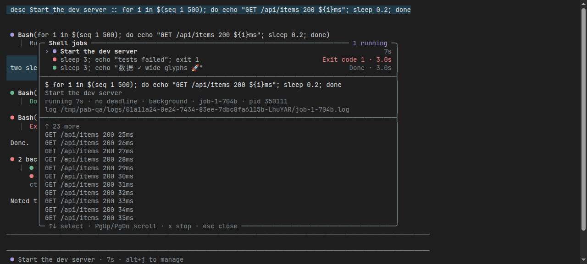

# pi-async-bash

**Long commands. Short waits.**

Claude-style Bash jobs for [Pi](https://pi.dev). Quick commands return normally. After two seconds, long commands move to the background and notify the agent when they finish.



*Real Pi terminal capture, rendered to PNG.*

## Install

```sh
pi install git:github.com/isthatyousaf/pi-async-bash
```

Restart Pi or run `/reload`. Requires **Pi 1.1.0+**. Tested on Linux.

## What you get

- **Live command rows** — compact output, elapsed time, and clear outcomes.
- **Background jobs** — automatic handoff, completion notices, and private output logs.
- **A jobs panel** — inspect commands, follow output, and stop work you no longer need.
- **Real deadlines** — `timeout` stays in seconds and still applies after handoff.

| Key | Action |
| --- | --- |
| `Alt+J` or `/bash-jobs` | Open jobs panel |
| `Ctrl+Alt+B` | Background foreground commands |
| `Ctrl+O` | Expand command output and details |
| `↑` / `↓` | Select a job in the panel |
| `PgUp` / `PgDn` | Scroll its output |
| `x`, then `x` | Stop the selected job |
| `Esc` | Close the panel |

The agent keeps using `bash`. It can also set `run_in_background: true` and use `bash_job` to list, inspect, wait for, or stop jobs. No polling is needed for completion notices.

## Configure

```sh
pi --bash-foreground-ms 5000   # Wait five seconds before handoff
pi --bash-foreground-ms off    # Only background when explicitly requested
```

Or set `PI_ASYNC_BASH_FOREGROUND_MS`. The flag takes precedence.

Jobs belong to the session: **quitting, switching sessions, or reloading stops them**. Automatic handoff defaults to off in one-shot print/JSON mode. Process cleanup covers the process group, not escaped daemons.

This extension replaces ordinary Pi `bash`, not `!` commands. It does not modify `pi-codex-conversion` or its execution tools.

[Behavior, limits & development](docs/reference.md) · [MIT license](LICENSE)
